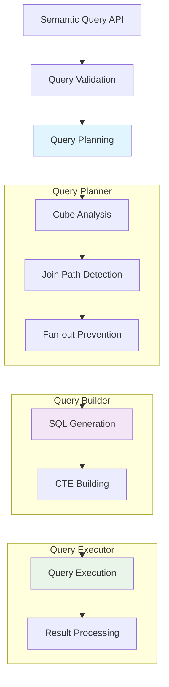
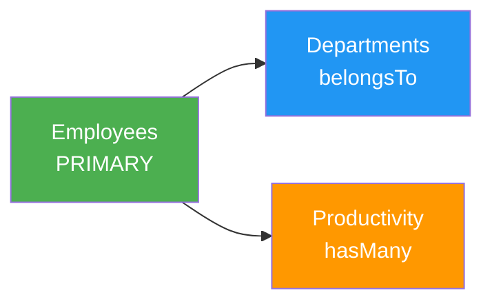
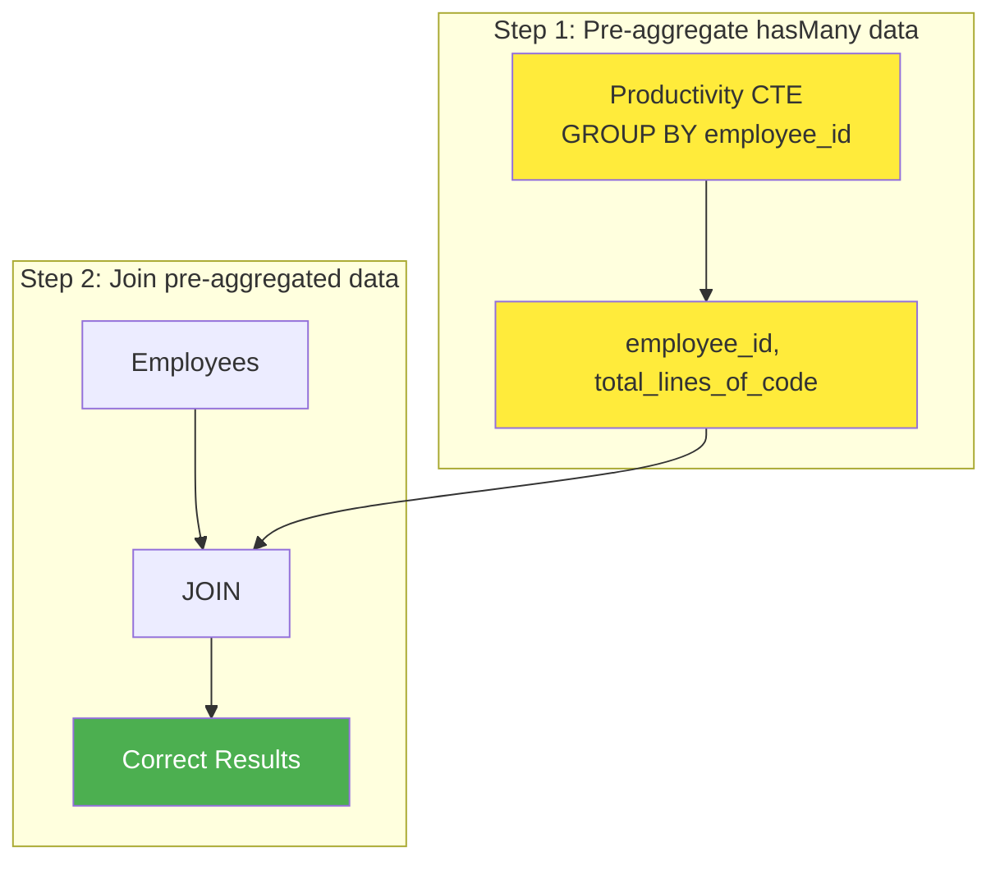

# How It Works: Deep Dive into Drizzle Cube's Query Architecture

This technical deep-dive explains how Drizzle Cube transforms semantic queries into optimized SQL and executes them safely at scale. Understanding this architecture will help you build better cubes, optimize performance, and debug complex queries.

## Overview: The Challenge

Analytics queries are fundamentally different from transactional queries. They often involve:
- **Complex aggregations** across multiple tables
- **Time-based grouping** with various granularities  
- **Cross-cube relationships** that can cause data fan-out
- **Dynamic filtering** that must be applied at the right query stage
- **Security constraints** that must be enforced consistently

Drizzle Cube solves these challenges through a sophisticated query planning and execution engine built on top of Drizzle ORM's type-safe SQL generation.

## Query Processing Pipeline



Let's examine each phase in detail.

## Phase 1: Query Planning

The `QueryPlanner` analyzes the incoming semantic query to understand which cubes are involved and how they should be joined.

### Cube Usage Analysis

```typescript
// Example semantic query
const query = {
  measures: ["Employees.count", "Productivity.totalLinesOfCode"],
  dimensions: ["Departments.name"],
  timeDimensions: [{ 
    dimension: "Productivity.date", 
    granularity: "month" 
  }],
  filters: [
    { member: "Employees.isActive", operator: "equals", values: [true] }
  ]
}
```

The planner extracts cube names from each query component:
- **Measures**: `Employees`, `Productivity`  
- **Dimensions**: `Departments`
- **Time Dimensions**: `Productivity`
- **Filters**: `Employees`

**Cubes involved**: `Employees`, `Departments`, `Productivity`

### Primary Cube Selection

The planner uses a sophisticated strategy to choose the primary cube:

1. **Dimension-based selection** - Prefer cubes with dimensions (they represent the "grain" of analysis)
2. **Connectivity check** - Ensure the primary cube can reach all other cubes via joins
3. **Consistency guarantee** - Use deterministic ordering to avoid query plan variations

For our example, `Employees` would be chosen as primary since it has connectivity to both `Departments` (belongsTo) and `Productivity` (hasMany).

### Join Path Detection

The planner uses **breadth-first search (BFS)** to find the shortest join path between cubes:



Each cube defines its relationships in the `joins` configuration:

```typescript
// From examples/hono/cubes.ts
employeesCube = defineCube('Employees', {
  joins: {
    Departments: {
      targetCube: () => departmentsCube,
      relationship: 'belongsTo',
      on: [{ source: employees.departmentId, target: departments.id }]
    },
    Productivity: {
      targetCube: () => productivityCube, 
      relationship: 'hasMany',
      on: [{ source: employees.id, target: productivity.employeeId }]
    }
  }
})
```

## Phase 2: Fan-out Prevention

The most critical challenge in multi-cube analytics is the **fan-out problem**.

### The Fan-out Problem

When joining a parent table to a child table in a `hasMany` relationship, each parent row gets duplicated for every child row. This causes **incorrect aggregation results**.

**Example**: Getting employee count and total lines of code:

```sql
-- Naive approach (WRONG)
SELECT 
    COUNT(employees.id) as employee_count,
    SUM(productivity.lines_of_code) as total_lines
FROM employees
JOIN productivity ON employees.id = productivity.employee_id
```

**Problem**: If Employee #1 has 30 productivity records, they get counted 30 times instead of once!

```
Employee 1 → Productivity Record 1, 2, 3, ..., 30
Employee 2 → Productivity Record 31, 32, 33, ..., 45  
Employee 3 → Productivity Record 46, 47, 48, ..., 60
```

**Result**: `employee_count = 90` (should be 3), `total_lines = correct`

### The CTE Solution

Drizzle Cube solves this using **Common Table Expressions (CTEs)** for pre-aggregation:



**Generated SQL with CTE**:

```sql
WITH productivity_agg AS (
  SELECT 
    employee_id,
    DATE_TRUNC('month', date) as month,          -- Time dimension computed in CTE
    SUM(lines_of_code) as totalLinesOfCode
  FROM productivity 
  WHERE organisation_id = $1
    AND date >= $2 AND date <= $3              -- Time filters applied in CTE
  GROUP BY employee_id, DATE_TRUNC('month', date)  -- Group by pre-computed time dimension
)
SELECT 
  departments.name,
  productivity_agg.month,                      -- Use pre-computed time dimension from CTE
  COUNT(employees.id) as employee_count,       -- Correct: each employee counted once
  SUM(productivity_agg.totalLinesOfCode) as total_lines_of_code
FROM employees
LEFT JOIN departments ON employees.department_id = departments.id  
LEFT JOIN productivity_agg ON employees.id = productivity_agg.employee_id
WHERE employees.organisation_id = $1
  AND employees.is_active = $4
GROUP BY departments.name, productivity_agg.month  -- Group by pre-computed values
ORDER BY productivity_agg.month ASC
```

### CTE Detection Logic

The planner automatically detects when CTEs are needed:

```typescript  
// From query-planner.ts:428
private planPreAggregationCTEs(
  cubes: Map<string, Cube<TSchema>>,
  primaryCube: Cube<TSchema>, 
  joinCubes: QueryPlan<TSchema>['joinCubes'],
  query: SemanticQuery
): QueryPlan<TSchema>['preAggregationCTEs'] {
  
  // Check each join cube for hasMany relationships
  for (const joinCube of joinCubes) {
    const hasManyJoinDef = this.findHasManyJoinDef(primaryCube, joinCube.cube.name)
    if (!hasManyJoinDef) continue // Not hasMany = no fan-out risk
    
    // Check if we have measures from this hasMany cube
    const measuresFromThisCube = query.measures?.filter(m => 
      m.startsWith(joinCube.cube.name + '.')
    ) || []
    
    if (measuresFromThisCube.length > 0) {
      // Create CTE to pre-aggregate this cube's data
      preAggCTEs.push({
        cube: joinCube.cube,
        cteAlias: `${joinCube.cube.name.toLowerCase()}_agg`,
        joinKeys: extractedJoinKeys,
        measures: measuresFromThisCube
      })
    }
  }
}
```

## Phase 3: SQL Generation with Drizzle

The `QueryBuilder` generates type-safe SQL using Drizzle ORM's query builder. **Every piece of SQL goes through Drizzle** - no string concatenation or manual SQL construction.

### Selection Building

```typescript
// From query-builder.ts:57
buildSelections(cubes, query, context): Record<string, SQL | AnyColumn> {
  const selections: Record<string, SQL | AnyColumn> = {}
  
  // Add dimensions with explicit aliases
  if (query.dimensions) {
    for (const dimensionName of query.dimensions) {
      const [cubeName, fieldName] = dimensionName.split('.')
      const cube = cubeMap.get(cubeName)
      if (cube && cube.dimensions[fieldName]) {
        const dimension = cube.dimensions[fieldName]
        const sqlExpr = resolveSqlExpression(dimension.sql, context)
        selections[dimensionName] = sql`${sqlExpr}`.as(dimensionName)
      }
    }
  }
  
  // Add measures with aggregation
  if (query.measures) {
    for (const measureName of query.measures) {
      const [cubeName, fieldName] = measureName.split('.')
      const measure = cube.measures[fieldName]
      const aggregatedExpr = this.buildMeasureExpression(measure, context)
      selections[measureName] = sql`${aggregatedExpr}`.as(measureName)
    }
  }
}
```

### Measure Expression Building

Measures can include complex filtering using `CASE WHEN` expressions:

```typescript
// From query-builder.ts:168
buildMeasureExpression(measure, context): SQL {
  let baseExpr = resolveSqlExpression(measure.sql, context)
  
  // Apply measure filters if they exist
  if (measure.filters && measure.filters.length > 0) {
    const filterConditions = measure.filters.map(filter => filter(context))
    const andCondition = and(...filterConditions)
    
    // Use CASE WHEN for conditional aggregation
    const caseExpr = this.databaseAdapter.buildCaseWhen([
      { when: andCondition, then: baseExpr }
    ])
    baseExpr = caseExpr
  }
  
  // Apply aggregation function
  switch (measure.type) {
    case 'count': return count(baseExpr)
    case 'sum': return sum(baseExpr)
    case 'avg': return this.databaseAdapter.buildAvg(baseExpr)
    // ... other aggregation types
  }
}
```

**Example generated SQL** for a filtered measure:

```sql
-- For measure: activeCount with filter on employees.active = true
COUNT(CASE WHEN employees.active = $1 THEN employees.id END) as activeCount
```

### WHERE vs HAVING Clause Separation

Drizzle Cube correctly separates dimension filters (WHERE) from measure filters (HAVING):

```typescript  
// Dimension filters → WHERE clause (before aggregation)
const whereConditions = this.queryBuilder.buildWhereConditions(cubes, query, context)
if (whereConditions.length > 0) {
  drizzleQuery = drizzleQuery.where(and(...whereConditions))
}

// Measure filters → HAVING clause (after aggregation) 
const havingConditions = this.queryBuilder.buildHavingConditions(cubes, query, context)
if (havingConditions.length > 0) {
  drizzleQuery = drizzleQuery.having(and(...havingConditions))
}
```

This ensures filters are applied at the correct stage of query processing.

## Phase 4: Query Execution

The `QueryExecutor` orchestrates the entire process:

```typescript
// From executor.ts:58
async execute(cubes, query, securityContext): Promise<QueryResult> {
  // 1. Validate query
  const validation = validateQueryAgainstCubes(cubes, query)
  if (!validation.isValid) throw new Error(validation.errors.join(', '))
  
  // 2. Create query context with security
  const context: QueryContext<TSchema> = {
    db: this.dbExecutor.db,
    schema: this.dbExecutor.schema,
    securityContext // Injected into all cube SQL functions
  }
  
  // 3. Create unified query plan  
  const queryPlan = this.queryPlanner.createQueryPlan(cubes, query, context)
  
  // 4. Build Drizzle query
  const builtQuery = this.buildUnifiedQuery(queryPlan, query, context)
  
  // 5. Execute with type conversion
  const numericFields = this.queryBuilder.collectNumericFields(cubes, query)
  const data = await this.dbExecutor.execute(builtQuery, numericFields)
  
  return { data, annotation: this.generateAnnotations(queryPlan, query) }
}
```

### CTE Building

When CTEs are needed, they're built first and referenced in the main query:

```typescript
// From executor.ts:142  
private buildPreAggregationCTE(cteInfo, query, context, queryPlan) {
  const cube = cteInfo.cube
  const cubeBase = cube.sql(context) // Gets security filtering automatically
  
  // Build CTE selections: join keys + measures + requested dimensions
  const cteSelections = {}
  
  // Add join key columns
  for (const joinKey of cteInfo.joinKeys) {
    cteSelections[joinKey.targetColumn] = joinKey.targetColumnObj
  }
  
  // Add measures with aggregation
  for (const measureName of cteInfo.measures) {
    const [, fieldName] = measureName.split('.')
    const measure = cube.measures[fieldName]
    const aggregatedExpr = this.queryBuilder.buildMeasureExpression(measure, context)
    cteSelections[fieldName] = sql`${aggregatedExpr}`.as(fieldName)
  }
  
  // Build CTE query with GROUP BY on join keys
  let cteQuery = context.db
    .select(cteSelections)
    .from(cubeBase.from)
    .where(cubeBase.where) // Security context applied
    .groupBy(...joinKeyColumns)
    
  return context.db.$with(cteInfo.cteAlias).as(cteQuery)
}
```

## Security and Type Safety

### Security Context Injection

Every cube's `sql` function receives a security context:

```typescript
// From examples/hono/cubes.ts
employeesCube = defineCube('Employees', {
  sql: (ctx: QueryContext<Schema>): BaseQueryDefinition => ({
    from: employees,
    // Security filtering applied automatically to every query
    where: eq(employees.organisationId, ctx.securityContext.organisationId)
  })
})
```

This ensures **every generated query** includes security constraints, preventing data leaks.

### SQL Injection Prevention  

All values go through Drizzle's parameterized query system:

```typescript
// Filter values are always parameterized
buildFilterCondition(fieldExpr, operator, values): SQL {
  const filteredValues = values.map(this.databaseAdapter.convertFilterValue)
  
  switch (operator) {
    case 'equals':
      return eq(fieldExpr, filteredValues[0]) // → WHERE field = $1
    case 'inDateRange': 
      return and(
        gte(fieldExpr, normalizedStartDate), // → WHERE field >= $2
        lte(fieldExpr, normalizedEndDate)    // → AND field <= $3
      )
  }
}
```

**No string concatenation ever occurs** - all SQL is built through Drizzle's type-safe methods.

## Performance Optimizations

### Intelligent Join Ordering

The query planner orders joins to minimize intermediate result sets:

1. **Primary cube** provides the base row set
2. **belongsTo relationships** joined first (typically reduces rows)
3. **hasMany relationships** use CTEs to avoid fan-out

### Database-Specific Adaptations

Different databases have different SQL dialects and performance characteristics:

```typescript
// PostgreSQL time dimension truncation
buildTimeDimension(granularity, baseExpr): SQL {
  switch (granularity) {
    case 'day': return sql`DATE_TRUNC('day', ${baseExpr})`
    case 'month': return sql`DATE_TRUNC('month', ${baseExpr})`
    case 'year': return sql`DATE_TRUNC('year', ${baseExpr})`
  }
}

// MySQL time dimension truncation  
buildTimeDimension(granularity, baseExpr): SQL {
  switch (granularity) {
    case 'day': return sql`DATE(${baseExpr})`
    case 'month': return sql`DATE_FORMAT(${baseExpr}, '%Y-%m-01')`
    case 'year': return sql`DATE_FORMAT(${baseExpr}, '%Y-01-01')`
  }
}
```

### Selective Type Conversion

Only numeric fields are converted from strings to numbers in the result processing:

```typescript
const numericFields = this.queryBuilder.collectNumericFields(cubes, query)
const data = await this.dbExecutor.execute(builtQuery, numericFields)
```

This avoids unnecessary type conversions on string dimensions and time values.

## Real-World Example

Let's trace through a complex query using our example cubes:

**Query**: "Show monthly productivity by department for active employees"

```typescript
const query = {
  measures: ["Employees.count", "Productivity.totalLinesOfCode"],
  dimensions: ["Departments.name"], 
  timeDimensions: [{
    dimension: "Productivity.date",
    granularity: "month",
    dateRange: ["2024-01-01", "2024-12-31"]
  }],
  filters: [
    { member: "Employees.isActive", operator: "equals", values: [true] }
  ]
}
```

**Query Plan**:
- **Primary Cube**: `Employees` (has dimensions + connectivity)
- **Join Cubes**: `Departments` (belongsTo), `Productivity` (hasMany)
- **CTE Required**: Yes (hasMany relationship with measures)

**Generated SQL**:

```sql
WITH productivity_agg AS (
  -- Pre-aggregate productivity data to prevent fan-out
  SELECT 
    employee_id,
    DATE_TRUNC('month', date) as month,
    SUM(lines_of_code) as totalLinesOfCode
  FROM productivity
  WHERE organisation_id = $1
    AND date >= $2 AND date <= $3
  GROUP BY employee_id, DATE_TRUNC('month', date)
)
SELECT 
  departments.name as "Departments.name",
  productivity_agg.month as "Productivity.date", 
  COUNT(employees.id) as "Employees.count",
  SUM(productivity_agg.totalLinesOfCode) as "Productivity.totalLinesOfCode"
FROM employees
LEFT JOIN departments ON employees.department_id = departments.id
LEFT JOIN productivity_agg ON employees.id = productivity_agg.employee_id 
  AND DATE_TRUNC('month', productivity_agg.month) = productivity_agg.month
WHERE employees.organisation_id = $1
  AND employees.is_active = $4
GROUP BY departments.name, productivity_agg.month
ORDER BY productivity_agg.month ASC
```

**Key points**:
- ✅ Security context applied to all tables (`organisation_id = $1`)
- ✅ Time filter applied in CTE to reduce data before join
- ✅ No fan-out - each employee counted once per month
- ✅ All values parameterized (`$1`, `$2`, `$3`, `$4`)
- ✅ Proper aggregation levels maintained

## Conclusion

Drizzle Cube's architecture solves the fundamental challenges of semantic layer analytics:

1. **Fan-out prevention** through intelligent CTE pre-aggregation
2. **Type safety** through Drizzle ORM integration  
3. **Security** through consistent context injection
4. **Performance** through optimized query planning
5. **Flexibility** through dynamic SQL generation

This sophisticated system allows developers to focus on defining business logic in cubes while the framework handles the complex query optimization and execution details automatically.

The result is **correct, performant, and secure** analytics queries that scale from simple dashboards to complex multi-cube analysis scenarios.